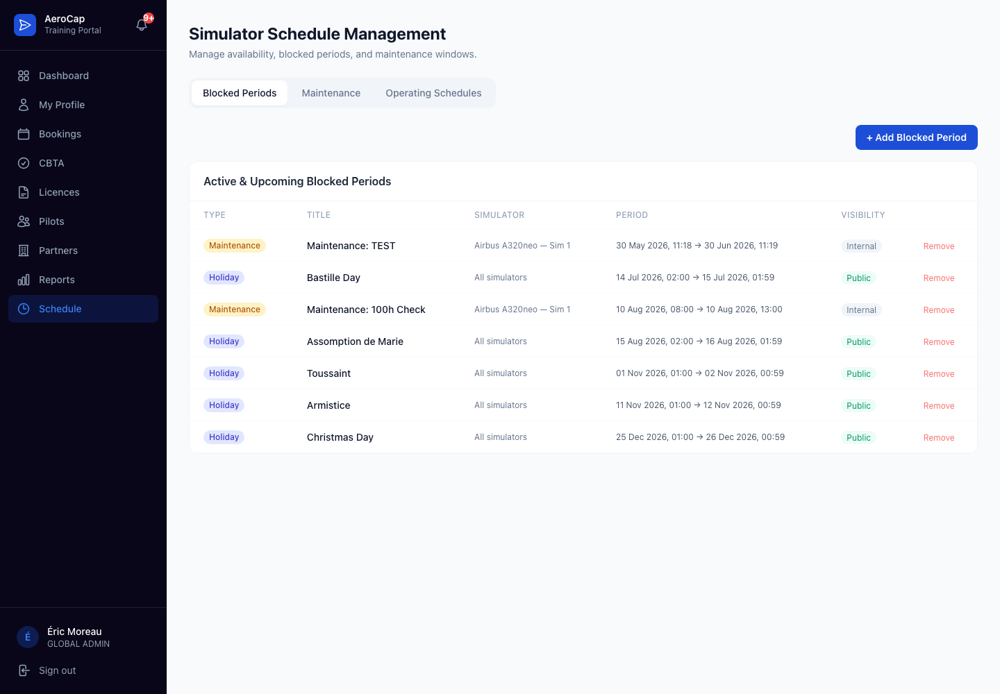
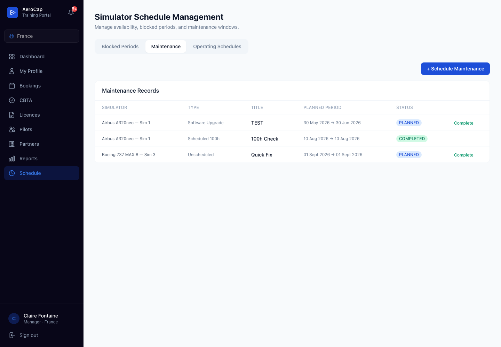
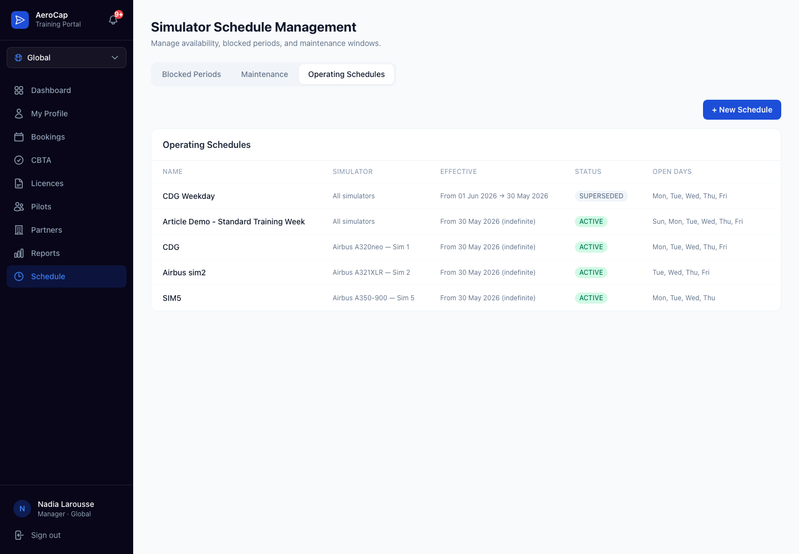
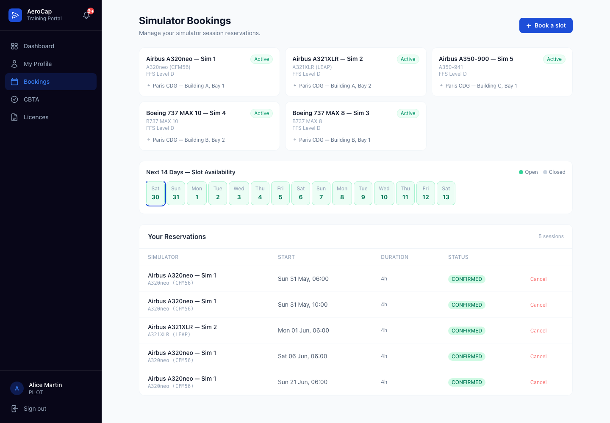
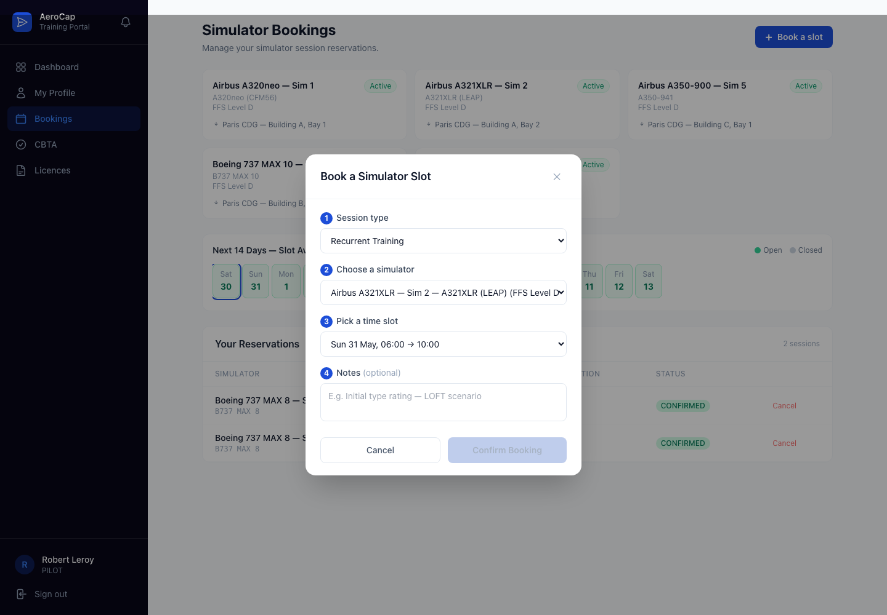
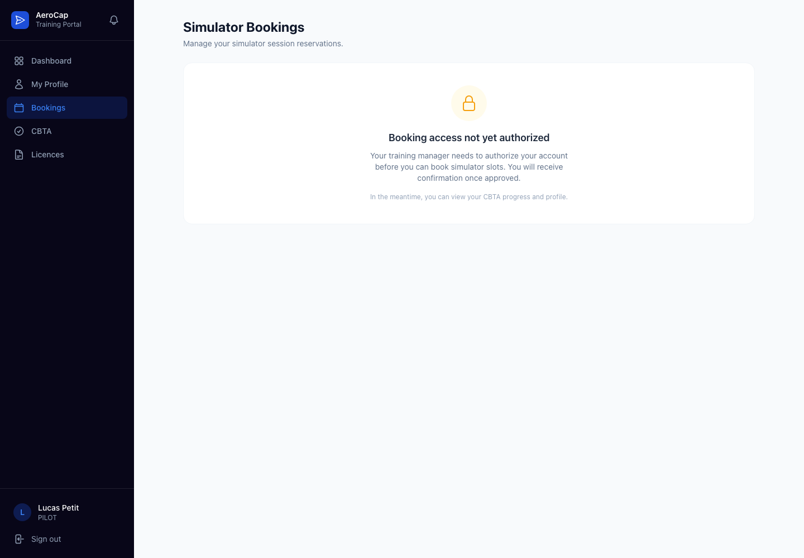

# From Prompt To Pilot-Safe Booking: Building Simulator Time Management With AI Agents

**Status:** Published  
**Last reviewed:** 2026-05-30  
**Repository context:** AeroCap — multi-tenant pilot training SaaS (TypeScript · Next.js · AWS)

---

## The Problem Is Not The Calendar

Every developer who has built a scheduling feature has at some point drawn a calendar on a whiteboard and thought: this is mostly a UI problem. Pick a date. Check availability. Book.

Simulator scheduling for commercial aviation training is not that feature.

When a pilot books a Full-Flight Simulator (FFS) session at an AeroCap facility, the booking has to pass a set of checks that have nothing to do with the visual calendar. The time window must fall inside an active operating schedule. The simulator must not be under maintenance, inspection, or an authority-mandated grounding. The facility must not be closed for a public or national holiday. The slot must not already be held by another crew. The pilot must be authorized to book — not just registered, but explicitly cleared by their airline's training manager. And all of this has to happen inside a tenant boundary: a pilot at Air France cannot see, book, or even discover that a simulator in South Africa exists.

If any one of those rules fails at booking creation time, the booking should not exist. A booking that lands on a maintenance window is not just an inconvenience — it may be unusable as regulatory evidence for the pilot's next Line Check or OPC.

That is the constraint that shaped the entire implementation. This article documents how I built simulator time management for AeroCap using a workflow of AI specialist agents, and what the agent-per-concern pattern actually looks like in practice for a domain with this much compliance weight.

---

## Context: What AeroCap Is

AeroCap is a multi-tenant SaaS pilot training portal operated by a leading independent simulator training organisation. It trains over 5,000 pilots a year across 250+ airline and military operators in 80 countries.

The platform serves two distinct models: **B2B** — airlines, military operators, and flight training organisations that onboard as tenants, with managers configuring schedules and compliance rules; and **B2C** — individual pilots, self-sponsored type rating candidates, and freelance pilots who book directly and manage their own training records. Both models share the same regulated infrastructure: data residency boundaries, CBTA evidence requirements, and multi-jurisdiction compliance apply equally to both.

The platform runs in four AWS regions — France, South Africa, China, and India — with strict data residency boundaries between them. Each region hosts a set of simulators (Level D FFS, FTD, FNPT) with their own facility operating schedules, local public holidays, maintenance cycles, and authority inspection windows.

The stack:

- **Frontend**: Next.js 14 App Router · TypeScript · Tailwind CSS · shadcn/ui
- **Auth**: AWS Cognito with OIDC, optional SAML SSO for airline operators
- **API**: AWS API Gateway → Express microservices in TypeScript
- **Database**: Aurora PostgreSQL with schema-per-tenant isolation · DynamoDB · S3
- **Events**: Amazon EventBridge
- **Workflow**: AWS Step Functions + N8N

Multi-tenancy is enforced at every layer. `tenantId` is extracted from the JWT on every request. It is never accepted from a request body for tenant-owned resources. Every Aurora query on a tenant table includes a `tenant_id` filter. Every service boundary validates with Zod before touching persistence.

---

## The Agent Workflow

Rather than writing simulator scheduling from scratch as a single large task, I used a four-agent workflow where each agent owns one concern:

| Agent | Concern |
|---|---|
| `spec-generator` | Define the domain contract — entities, schema, API shape, events, edge cases, acceptance criteria |
| `training-management` | Validate the contract against aviation training and regulatory requirements |
| `backend-developer` | Implement models, APIs, Zod validation, authorization, and conflict checks |
| `frontend-developer` | Build operational screens for managers and the booking flow for pilots |

The agents do not share state or memory between themselves. Each receives a well-defined input and produces a well-defined output. The spec is the hand-off artifact between spec-generator, training-management, and the two implementation agents.

This matters because it forces every concern to be explicit. When `training-management` reviews the spec before a single line of TypeScript is written, it catches domain errors that are invisible to a general-purpose backend agent. When the frontend agent receives a finalized, domain-validated contract, it cannot accidentally expose a booking path that the backend has not yet committed to enforcing.

---

## Step 1 — Generate The Specification

### The Prompt

```text
As @subagents/spec-generator.md, create a specification for Simulator Time Management.

Requirements:
- Admins/managers can define simulator availability, holidays, maintenance periods,
  and schedule exceptions.
- Pilots can only view and book available time slots.
- Prevent bookings during unavailable, maintenance, holiday, or already-booked periods.
- Include roles, booking rules, validations, edge cases, and acceptance criteria.

Validate the resulting specification with @subagents/training-management.md to ensure
it meets training and simulator scheduling requirements.
```

### What The Spec Defines

The output is `specs/simulator-time-management-spec.md`. Its most important sections are summarised here.

#### Entities and Ownership

The spec separates two service boundaries cleanly.

**`schedule-service`** owns facility-level time:

```
OperatingSchedule   — regular opening windows (day-of-week, time range, effective dates)
BlockedPeriod       — closures: holiday, maintenance, inspection, weather, special event
MaintenanceRecord   — simulator-specific downtime with start, end, affected unit
AvailabilityOverride — exceptional openings that punch through a blocked period
```

**`booking-service`** owns crew-level time:

```
Simulator           — physical unit with type, level (FFS/FTD/FNPT), tenant scope
Slot                — raw time window on a simulator
Reservation         — a pilot's confirmed booking, linked to a slot
WaitingList         — queue when the slot is taken
```

#### The Tenant Rule

The spec states this explicitly so that neither implementation agent can miss it:

> `tenantId` MUST be extracted from the authenticated session JWT. It MUST NOT be accepted from the request body, query parameters, or URL path segments for any operation that creates or reads tenant-owned data. Violation of this rule constitutes a data-isolation defect and must be caught at code review.

This is not just a policy. It is an implementation constraint that the backend agent treats as a non-negotiable. The spec includes a Zod schema that deliberately omits `tenantId` from every request body type, so the compiler enforces it structurally.

```typescript
// From the spec — request body schema for creating a blocked period
const CreateBlockedPeriodSchema = z.object({
  simulatorId: z.string().uuid().optional(), // null = facility-wide
  type: z.enum(['HOLIDAY', 'MAINTENANCE', 'INSPECTION', 'WEATHER', 'SPECIAL_EVENT']),
  startDate: z.string().datetime(),
  endDate: z.string().datetime(),
  reason: z.string().min(3).max(500),
  affectsAllSimulators: z.boolean().default(false),
}).refine(
  (data) => new Date(data.endDate) > new Date(data.startDate),
  { message: 'endDate must be after startDate', path: ['endDate'] }
);
// tenantId is intentionally absent — the service injects it from the JWT
```

#### Availability Algorithm

The spec describes availability resolution as a priority-ordered check, not a single flag lookup:

```
1. Is there an active OperatingSchedule that covers this day and time window?
   No  → UNAVAILABLE (facility closed)
2. Is there a BlockedPeriod (any type) that overlaps this window?
   Yes → BLOCKED (returns block type and reason)
3. Is there a MaintenanceRecord on this simulator that overlaps this window?
   Yes → MAINTENANCE
4. Is there an AvailabilityOverride that explicitly opens this window?
   Yes → OVERRIDE_OPEN (overrides a blocked period)
5. Is there an existing Reservation on this slot?
   Yes → ALREADY_BOOKED
6. Otherwise → AVAILABLE
```

This resolution order matters for cases like a facility holiday that coincides with a pre-approved training override for a military operator. The override wins over the block. The spec captures that decision explicitly so the frontend agent renders the right colour and the backend agent enforces the right rule.

#### Edge Cases The Spec Names

- A maintenance window created while a pilot already has a reservation in that window. (Resolution: existing reservation is not automatically cancelled; it enters a `CONFLICT` state that a manager must resolve.)
- A pilot with `bookingAuthorized = false` submitting a booking request. (Resolution: the API returns 403 with a specific error code. The pilot UI should show the locked state before the pilot reaches the booking modal, but the API enforces it independently.)
- A same-day booking inside an operating schedule but outside the simulator's defined session duration slots. (Resolution: slots are pre-computed by the schedule service; the booking API only accepts slot IDs, not arbitrary time windows.)
- Double-booking a slot if two concurrent requests arrive for the same slot ID. (Resolution: a database-level unique constraint on `(slot_id, status)` where `status IN ('CONFIRMED', 'PENDING')`. The second request receives a 409 Conflict.)

---

## Step 2 — Validate With The Domain Agent

### The Prompt

```text
As @subagents/training-management.md, review specs/simulator-time-management-spec.md
for compliance with aviation simulator training requirements.

Focus on:
- Session-type spacing rules (OPC, LPC, type rating recency)
- Regulatory authority inspection impact on booking evidence
- Maintenance grounding impact on training record validity
- Crew pairing and simulator sharing rules
- Any spec gap that would make a booking unusable as regulatory evidence
```

### What The Domain Review Found

The `training-management` agent flagged three gaps that the spec-generator had not captured:

**Gap 1: Authority inspection periods must be flagged differently from routine maintenance.**

A simulator under authority inspection (JAA, EASA, GCAA) cannot produce valid training evidence for any session run during that window, even if the session technically completes. The spec had lumped `INSPECTION` into the `BlockedPeriod` type enum, which is correct for availability, but the domain agent noted that `INSPECTION` blocks should carry a `regulatoryBody` field and generate a specific audit event, so that compliance reports can show the window with evidence context.

The fix added two fields to `BlockedPeriod`:

```typescript
regulatoryBody: z.string().max(50).optional(), // EASA, JAA, GCAA, etc.
evidenceImpact: z.enum(['NONE', 'VOID', 'REQUIRES_REVIEW']).default('NONE'),
```

**Gap 2: OPC/LPC spacing is a booking rule, not a schedule rule.**

The spec had placed session-type spacing (a pilot must not do two OPC sessions within 60 days) under the schedule service. The domain agent correctly pointed out this belongs in the booking service as a per-pilot validation, not as a facility-level constraint. A facility does not know which pilot is booking which session type. The booking service does.

This changed the architecture: the booking service gained a `sessionTypeRules` table per airline operator, and booking creation now checks the pilot's recent session history before confirming.

**Gap 3: The 14-day availability window was not enough for some training programmes.**

Type rating programmes can span 90+ days. The pilot-facing calendar showing only 14 days forward would force returning pilots to navigate week by week. The domain agent recommended the calendar read model expose a `programmeWindow` mode that returns availability for the pilot's specific programme period, regardless of length.

This led to the calendar API supporting two modes:

```typescript
GET /schedule/calendar?simulatorId=<id>&mode=rolling&days=14
GET /schedule/calendar?simulatorId=<id>&mode=programme&programmeId=<id>
```

---

## Step 3 — Implement The Backend

### The Prompt

```text
As @subagents/backend-developer.md, implement the schedule-service and booking-service
from specs/simulator-time-management-spec.md.

Use the existing service scaffold pattern in services/booking-service and
services/schedule-service. Add:
- Database migrations for all new entities
- Express route handlers with Zod request validation
- Authorization middleware that injects tenantId from JWT
- Booking conflict check that calls schedule-service availability
- Unit tests for all conflict scenarios
- EventBridge events for schedule mutations and booking state changes

Do not trust any tenant context from request bodies. Use jwtMiddleware(req) exclusively.
```

### The Service Boundary in Code

The backend implementation split cleanly along the spec's service boundary.

**`schedule-service`** exposes:

```
POST   /schedule/operating-schedules
GET    /schedule/operating-schedules
POST   /schedule/blocked-periods
GET    /schedule/blocked-periods
PUT    /schedule/blocked-periods/:id
DELETE /schedule/blocked-periods/:id
POST   /schedule/maintenance
GET    /schedule/maintenance
GET    /schedule/calendar          (the availability read model)
GET    /schedule/calendar/overrides
POST   /schedule/overrides
```

**`booking-service`** exposes:

```
GET    /booking/simulators
GET    /booking/simulators/:id/slots
POST   /booking/reservations
GET    /booking/reservations
PUT    /booking/reservations/:id/cancel
GET    /booking/waiting-list
POST   /booking/waiting-list
```

The booking creation handler is where the most important integration point lives. It calls the schedule service's availability check before committing a reservation:

```typescript
// services/booking-service/src/routes/reservations.ts
router.post('/', jwtMiddleware, async (req, res) => {
  const { tenantId, userId, role } = req.jwt;

  const body = CreateReservationSchema.safeParse(req.body);
  if (!body.success) {
    return res.status(400).json({ error: body.error.flatten() });
  }

  // Check pilot authorization — bookingAuthorized must be true
  const pilot = await db.pilotProfile.findFirst({
    where: { userId, tenantId },
  });
  if (!pilot?.bookingAuthorized && role !== 'MANAGER' && role !== 'ADMIN') {
    return res.status(403).json({
      code: 'BOOKING_NOT_AUTHORIZED',
      message: 'Your account is pending manager approval for simulator booking.',
    });
  }

  // Check schedule availability via internal service call
  const availability = await scheduleClient.checkAvailability({
    tenantId,
    simulatorId: body.data.simulatorId,
    slotId: body.data.slotId,
    startTime: body.data.startTime,
    endTime: body.data.endTime,
  });

  if (availability.status !== 'AVAILABLE' && availability.status !== 'OVERRIDE_OPEN') {
    return res.status(409).json({
      code: 'SLOT_UNAVAILABLE',
      reason: availability.status,
      detail: availability.reason ?? null,
    });
  }

  // Check session-type spacing for OPC/LPC
  if (body.data.sessionType && ['OPC', 'LPC'].includes(body.data.sessionType)) {
    const recentSession = await db.reservation.findFirst({
      where: {
        tenantId,
        pilotId: userId,
        sessionType: body.data.sessionType,
        startTime: { gte: subDays(new Date(), 60) },
        status: 'CONFIRMED',
      },
    });
    if (recentSession) {
      return res.status(409).json({
        code: 'SESSION_TYPE_SPACING_VIOLATION',
        message: `${body.data.sessionType} sessions must be at least 60 days apart.`,
        lastSession: recentSession.startTime,
      });
    }
  }

  // Attempt atomic reservation — unique constraint on (slotId, status) handles races
  try {
    const reservation = await db.reservation.create({
      data: {
        tenantId,
        pilotId: userId,
        simulatorId: body.data.simulatorId,
        slotId: body.data.slotId,
        sessionType: body.data.sessionType,
        startTime: body.data.startTime,
        endTime: body.data.endTime,
        status: 'CONFIRMED',
      },
    });

    await eventBridge.putEvents({
      Entries: [{
        Source: 'aerocap.booking-service',
        DetailType: 'ReservationCreated',
        Detail: JSON.stringify({ tenantId, reservationId: reservation.id, pilotId: userId }),
      }],
    });

    return res.status(201).json(reservation);
  } catch (err) {
    if (isDuplicateKeyError(err)) {
      return res.status(409).json({
        code: 'SLOT_ALREADY_BOOKED',
        message: 'Another booking was confirmed for this slot while you were completing the form.',
      });
    }
    throw err;
  }
});
```

Notice that `tenantId` is never touched from `req.body`. It comes exclusively from `req.jwt`. This is enforced at the type level: `CreateReservationSchema` has no `tenantId` field, so the TypeScript compiler will reject any attempt to read it from the body.

### Database Migrations

The backend agent produced Aurora PostgreSQL migrations for both services. The `schedule-service` migration for `blocked_periods`:

```sql
CREATE TABLE blocked_periods (
  id            UUID PRIMARY KEY DEFAULT gen_random_uuid(),
  tenant_id     UUID NOT NULL REFERENCES tenants(id),
  simulator_id  UUID REFERENCES simulators(id) ON DELETE CASCADE,
  type          TEXT NOT NULL CHECK (type IN (
    'HOLIDAY', 'MAINTENANCE', 'INSPECTION', 'WEATHER', 'SPECIAL_EVENT'
  )),
  start_date    TIMESTAMPTZ NOT NULL,
  end_date      TIMESTAMPTZ NOT NULL,
  reason        TEXT NOT NULL,
  affects_all   BOOLEAN NOT NULL DEFAULT FALSE,
  regulatory_body TEXT,
  evidence_impact TEXT NOT NULL DEFAULT 'NONE' CHECK (
    evidence_impact IN ('NONE', 'VOID', 'REQUIRES_REVIEW')
  ),
  created_by    UUID NOT NULL REFERENCES users(id),
  created_at    TIMESTAMPTZ NOT NULL DEFAULT NOW(),
  updated_at    TIMESTAMPTZ NOT NULL DEFAULT NOW(),

  CONSTRAINT end_after_start CHECK (end_date > start_date)
);

CREATE INDEX idx_blocked_periods_tenant_dates
  ON blocked_periods (tenant_id, start_date, end_date);

CREATE INDEX idx_blocked_periods_simulator
  ON blocked_periods (simulator_id, start_date, end_date)
  WHERE simulator_id IS NOT NULL;
```

The index on `(tenant_id, start_date, end_date)` is critical for the calendar read model, which filters the entire blocked-period set for a given tenant and date range in a single scan. Without it, the calendar endpoint would table-scan on every pilot page load.

The reservation table uses a partial unique index to handle double-booking atomically:

```sql
CREATE UNIQUE INDEX idx_reservations_slot_active
  ON reservations (slot_id)
  WHERE status IN ('CONFIRMED', 'PENDING');
```

This means the database itself rejects a second confirmed or pending booking for the same slot, regardless of whether two API requests race past the application-level availability check simultaneously.

### Authorization Model

The backend uses a role matrix extracted from the spec:

| Action | PILOT | MANAGER | ADMIN |
|---|---|---|---|
| View operating schedules | ✓ (read own tenant) | ✓ | ✓ |
| Create/edit operating schedules | — | ✓ (own tenant) | ✓ |
| Create/edit blocked periods | — | ✓ (own tenant) | ✓ |
| Delete blocked periods | — | — | ✓ |
| View maintenance records | ✓ (read-only) | ✓ | ✓ |
| Create/close maintenance records | — | ✓ (own tenant) | ✓ |
| Create reservations | ✓ (if authorized) | ✓ | ✓ |
| Cancel own reservation | ✓ | ✓ | ✓ |
| Cancel another pilot's reservation | — | ✓ (own tenant) | ✓ |

The `MANAGER` scope is tenant-scoped, meaning a manager at one airline operator cannot affect another operator's schedules even within the same AeroCap region. This is enforced by the `tenantId` filter on every write operation, not by a role check alone.

---

## Step 4 — Build The Frontend

### The Prompt

```text
As @subagents/frontend-developer.md, implement the simulator time management UI
from specs/simulator-time-management-spec.md.

Build two main surfaces:
1. /schedule — Admin and manager operational controls for blocked periods,
   maintenance records, and operating schedules.
2. /bookings — Pilot-facing simulator overview, 14-day availability strip,
   booking modal, and pending-approval lock state.

Use the existing shadcn/ui component library. Show only valid slots to pilots.
Gate all create/edit/delete actions behind role checks from the JWT claims.
Do not expose schedule management controls to PILOT role users.
```

### The Manager Experience: `/schedule`

The `/schedule` page gives admins and facility managers operational control over simulator time. It is tab-organised by concern:

**Blocked Periods tab** — A table of current and upcoming blocks (holiday, maintenance, inspection, weather, special event) with a colour-coded badge per type. Admins can create new blocks via a form modal. Managers can create blocks but cannot delete them — deletion is admin-only because blocked periods may already be linked to cancelled or conflicted reservations.



The blocked period form includes the `regulatoryBody` and `evidenceImpact` fields added by the domain agent review. When a manager selects `INSPECTION` as the block type, the form reveals these fields and shows a warning: sessions booked during an authority inspection window may not be accepted as regulatory evidence.

**Maintenance tab** — A list of maintenance records linked to specific simulators. Each record shows the unit, type of work, start and end dates, technician, and current status (PLANNED, IN_PROGRESS, COMPLETED). When a manager creates a maintenance record, the schedule service automatically projects a blocked period for that simulator's time window. The pilot-facing calendar sees the block without knowing its source.



**Operating Schedules tab** — A weekly grid showing the facility's regular opening windows. Each schedule entry has a day-of-week set, a time range, and optional effective-from and effective-until dates to handle seasonal changes. The global manager view shows all simulators together; the tenant-scoped manager view shows only their operator's simulators.



### The Pilot Experience: `/bookings`

The `/bookings` page is built around what a pilot should never have to think about.

**Simulator overview** — A card grid of available simulators in the pilot's tenant. Each card shows the unit type (B737-800 FFS, A320neo FFS, etc.), qualification level, location, and current operational status. Simulators under maintenance show a maintenance badge. Simulators in another tenant do not appear at all.

**14-day availability strip** — A horizontal date strip for a selected simulator. Each day is colour-coded:

- Green: available under active operating schedule, no blocks
- Amber: available with reduced hours (schedule override)
- Grey: no operating schedule coverage (facility closed)
- Red: explicitly blocked (holiday, maintenance, inspection)
- Dark: past or outside the selectable window

The colour state comes from the calendar read model endpoint, not from client-side date arithmetic. The frontend does not re-implement the availability resolution logic. It renders what the service returns.



**Booking modal** — When a pilot selects an available day, the modal loads the pre-computed slots for that simulator and day. Slots are returned only if they pass the full availability check server-side. The frontend does not filter slots itself; it displays whatever the API returns. If no slots are available (all taken, all outside schedule), the modal shows an empty state with the reason code.



**Pending-approval lock** — Pilots whose `bookingAuthorized` flag is `false` see a different state on the `/bookings` page. The simulator cards and calendar strip are visible (so the pilot can plan), but the booking action is replaced by a message explaining that their training manager must approve booking access first. There is no booking modal in this state. The lock is enforced both by the UI rendering and by the API returning 403 if bypassed.



### The Key Frontend Design Choice

The pilot UI removes invalid time from the decision path rather than warning about it after the fact.

A common pattern in scheduling tools is to show all time and then surface an error message when the user tries to book an unavailable slot. That pattern puts the cognitive load on the pilot: browse all slots, pick one, receive error, pick again.

AeroCap's pilot booking flow hides unavailable days in the strip (they are still visible but not selectable), and hides unavailable slots in the modal. The pilot sees only time the system is willing to book. The UX decision and the business rule reinforce each other.

---

## The Architecture Gap — And Why It Is Named

The validation checklist in the spec deliberately names one gap that the current implementation does not close:

> Booking creation checks schedule availability via a synchronous internal service call. If the `schedule-service` is temporarily unreachable, the booking service must decide: fail the booking, or allow it and accept the risk that the slot was blocked. The current implementation fails the booking (safe default). The production implementation should enforce availability synchronously or use reliable event propagation (e.g., EventBridge with a DLQ) to propagate blocked periods into the booking service's own read model, so it can answer availability questions without a live cross-service call.

This is named explicitly because the alternative — silently shipping without the note — would leave the next engineer who maintains the service unaware of the dependency. The architecture gap becomes a ticket, not a surprise incident.

The recommended production path is a local read model: the booking service subscribes to `BlockedPeriodCreated`, `MaintenanceRecordCreated`, and `OperatingScheduleUpdated` events from EventBridge and maintains a denormalised availability cache in DynamoDB. Booking creation reads from this local cache rather than calling the schedule service synchronously. The DLQ ensures that a missed event is retried rather than silently dropped, and a reconciliation job runs nightly to detect drift.

---

## What The Agent Workflow Adds (And What It Does Not)

### What It Adds

**Spec-first discipline is enforced, not just encouraged.** When the first prompt goes to a spec-generator rather than a backend agent, the spec exists before the implementation. The domain review happens before the code. Edge cases are named in a document that both implementation agents read. The frontend agent cannot accidentally show a booking path the backend has not committed to supporting, because both were built from the same spec.

**Domain knowledge is separated from implementation knowledge.** The `training-management` agent knows that authority inspections affect evidence validity. The backend agent knows how to write a race-safe unique constraint. Neither would have caught the other's gap in a single-agent implementation. Separation surfaces what each specialist is good at.

**The prompts are architecture decisions, not just instructions.** The choice to call `scheduleClient.checkAvailability` from inside the booking handler, rather than trusting the frontend calendar, is a trust boundary decision. Writing the prompt forces that decision to be explicit before the code exists.

### What It Does Not Add

**Agents do not replace design review.** The spec-generator produces a good first draft. It does not know your organisation's specific regulatory authority (DGAC, SACAA, CAAC, DGCA) or your operator's specific contract clauses. Those require human review before the spec goes to implementation.

**Agents do not catch runtime integration failures.** The booking-to-schedule service call was tested with unit mocks in the backend agent's output. It was not integration-tested against a running Aurora instance. The architecture gap discussion above exists because the agent identified the pattern, but a full integration test suite requires real infrastructure.

**The agent output is a starting point, not a finished system.** Every file produced by the implementation agents went through a code review pass (using the `code-reviewer` subagent and a human pass). The agents produce well-structured, type-safe, reasonably complete code. They do not produce production-ready code that ships without review.

---

## Validation Checklist

Use this checklist to verify the feature before merging:

- [ ] A manager can create a blocked period and see it on `/schedule`.
- [ ] A blocked period on a date makes that date non-bookable in the pilot calendar strip.
- [ ] A manager can create a maintenance record and have it project a simulator-specific block.
- [ ] An availability override on a blocked date makes that date bookable again.
- [ ] A pilot can open `/bookings` and see available versus unavailable days.
- [ ] The booking modal only shows slots on available or override-open dates.
- [ ] A pending pilot (`bookingAuthorized = false`) sees the lock screen, not booking controls.
- [ ] Submitting a booking for a blocked slot via the API (bypassing the UI) returns 409 with `SLOT_UNAVAILABLE`.
- [ ] Submitting two concurrent booking requests for the same slot returns 409 with `SLOT_ALREADY_BOOKED` for the second request.
- [ ] An OPC session submitted within 60 days of a previous OPC returns 409 with `SESSION_TYPE_SPACING_VIOLATION`.
- [ ] `tenantId` injected from a request body is ignored — the service uses the JWT value.
- [ ] A pilot cannot see or book simulators from another tenant.
- [ ] Backend tests cover pilot authorization, double booking, session rules, and cancellation ownership.
- [ ] EventBridge events are emitted for blocked period creation and reservation creation.

---

## Closing

Simulator time management looks like a calendar problem. In AeroCap it is a compliance, safety, and tenant-isolation problem, where a mishandled booking window can produce training records that a regulatory authority will not accept as evidence.

The agent workflow kept that complexity visible across the entire feature lifecycle. The spec agent surfaced the entities and trust boundaries. The domain agent caught the evidence-impact gap that a backend engineer would not have known to ask about. The implementation agents produced type-safe, tenant-isolated code that the review pass could audit efficiently. The frontend agent built pilot flows that hide invalid time rather than warning about it.

The next production step is well-defined: close the cross-service availability dependency by giving the booking service its own EventBridge-backed read model for blocked periods, so booking creation does not carry a synchronous dependency on the schedule service at the moment a pilot submits.

The prompts are not a replacement for that architectural work. They are what made the problem legible enough to know exactly what the remaining work is.

---

*Platform engineering — Abdelhamid Zeglami · Feat GenAI*
