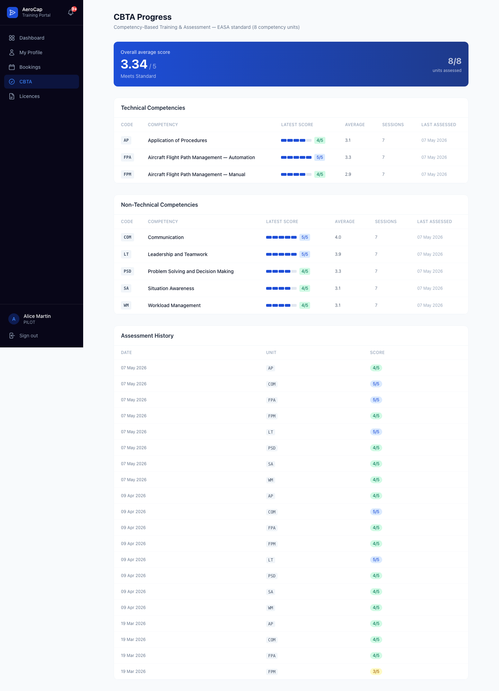
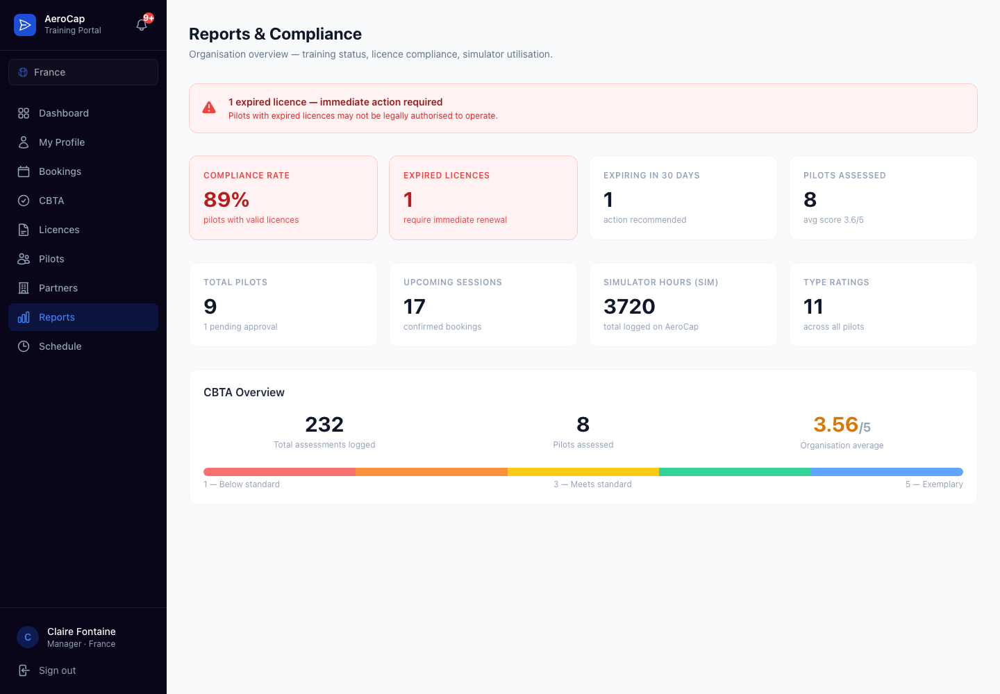
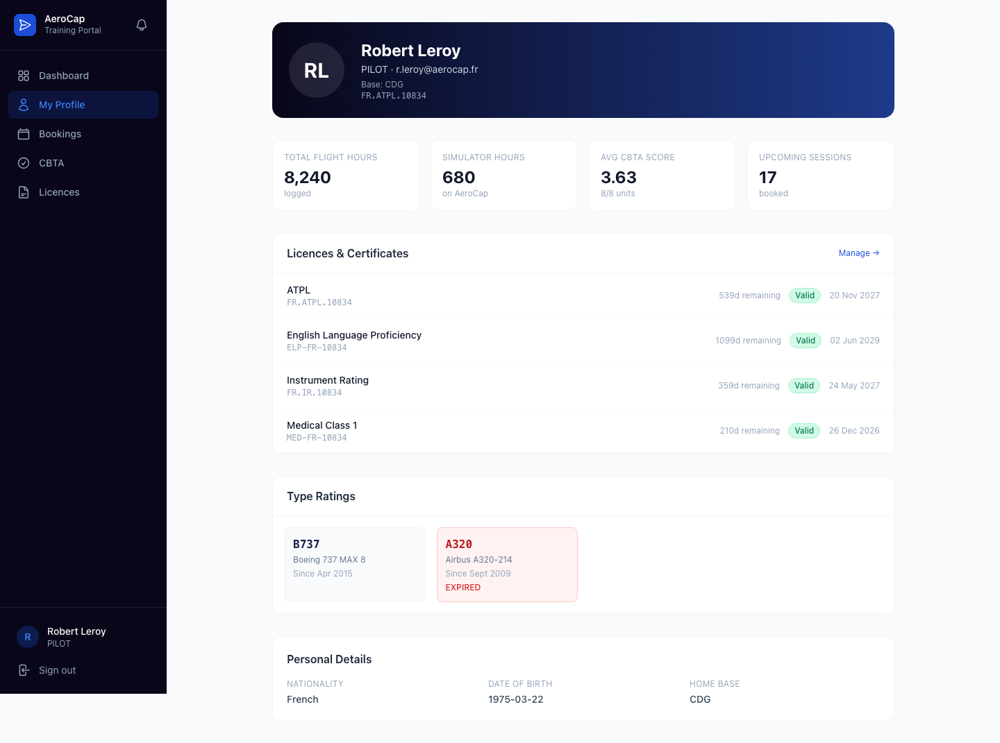
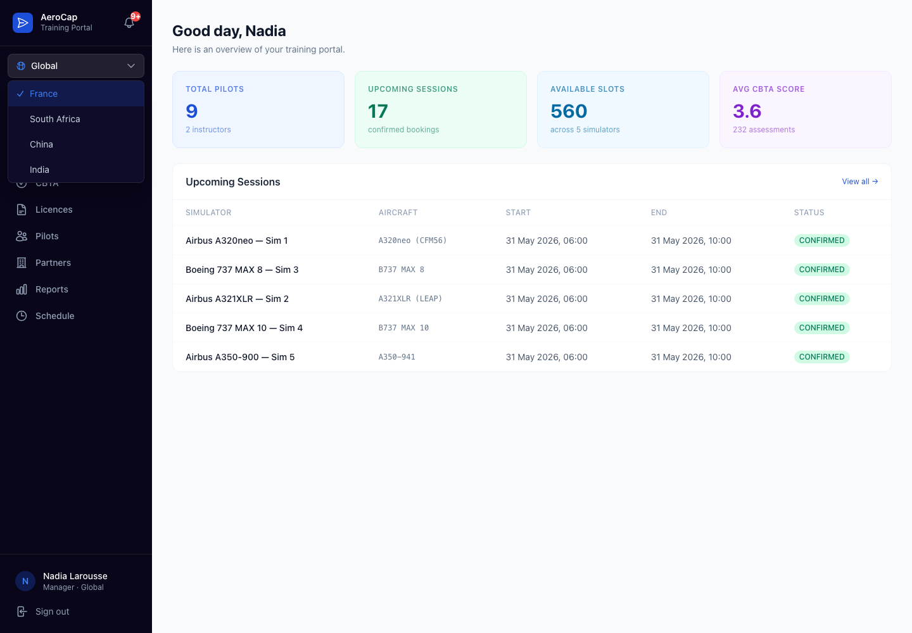

# From Competency Gap to Compliance Evidence: Building CBTA Tracking and Regulatory Reporting with AI Agents

**Status:** Published  
**Last reviewed:** 2026-05-30  
**Repository context:** AeroCap — multi-tenant pilot training SaaS (TypeScript · Next.js · AWS)  
**Repository:** [github.com/zeglami/aerocap-training-platform](https://github.com/zeglami/aerocap-training-platform)

---

## The Problem Is Not a Grade Book

Every developer who has built a training records system has at some point drawn a table on a whiteboard and thought: this is mostly a score storage problem. Pilot completes a session. Instructor rates performance. Score saved. Done.

Competency-Based Training and Assessment for commercial aviation is not that feature.

When an instructor at an AeroCap facility records a CBTA assessment for a pilot, the record has to be more than a row in a table. It must be linked to a specific ICAO competency unit with a defined performance indicator set. It must be timestamped and signed in a way that an EASA or SACAA inspector can verify its chain of custody. If the score is Below Standard, it must automatically open a deficit that requires documented remediation before the pilot can qualify for a line check. If the pilot later exercises a GDPR erasure right, the record must be pseudonymised — not deleted — because the aviation authority needs to inspect the structural evidence years later. And all of this must happen inside a tenant boundary: a score recorded at AeroCap France must never appear in an AeroCap South Africa report.

That is the constraint that shaped the implementation. This article documents how I built CBTA competency tracking and regulatory compliance reporting for AeroCap using the same AI specialist agent workflow used for simulator time management, and what the domain-specific gaps look like when the domain is aviation safety rather than scheduling.

---

## What CBTA Is, and Why It Matters Regulatorily

CBTA — Competency-Based Training and Assessment — is the training framework defined in ICAO Doc 9868 PANS-TRG and adopted by EASA, FAA, SACAA, CAAC, and DGCA as the standard for commercial pilot qualification and recurrency training.

The traditional model trained pilots against a list of tasks and manoeuvres. A pilot who demonstrated all required manoeuvres to the required standard was qualified. The problem with this model is that it does not distinguish between a pilot who performs procedures mechanically and a pilot who understands the system and can adapt when conditions change.

CBTA measures both. It defines eight competency units, each with a set of behavioural performance indicators that an instructor observes during a simulator session:

| Competency Unit | Code | Type |
|---|---|---|
| Application of Procedures | APP | Technical |
| Communication | COM | Technical |
| Aircraft Flight Path Management — Automation | FPA | Technical |
| Aircraft Flight Path Management — Manual | FPM | Technical |
| Leadership and Teamwork | LTW | Non-Technical |
| Problem Solving and Decision Making | PSD | Non-Technical |
| Situation Awareness | SAW | Non-Technical |
| Workload Management | WLM | Non-Technical |

Each competency is scored on a four-level standard:

- **Below Standard (1):** Performance does not meet the required standard. Deficit must be opened.
- **Meets Standard (2):** Required level for qualified line operations.
- **Above Standard (3):** Consistently exceeds standard across observed indicators.
- **Exceptional (4):** Sustained exceptional performance across all indicators in the session.

A single session produces up to eight scores — one per competency unit, though not all units are assessed in every session type. The running average across a pilot's history is the metric that regulatory authorities inspect when evaluating whether a pilot's training programme is working.

If any competency unit falls Below Standard, the training programme is obligated to document it, create a remedial action, and re-assess the pilot before certifying them for their next qualification event. An unresolved deficit on a pilot's record is not an internal training note — it is a compliance exposure.

---

## Context: Where CBTA Fits in AeroCap

AeroCap serves 5,000+ pilots across 250+ airline and military operators in four data-residency regions: France (GDPR), China (PIPL), South Africa (POPIA), and India (DPDP Act). The platform operates across two commercial models — **B2B** for airline operators and training organisations who are onboarded as partner tenants via the `partner-service` (:3012), which manages partner organisations, member rosters, and booking authorisation under a dedicated `PARTNER_ADMIN` role; and **B2C** for individual pilots who access the platform directly to book simulator time, track their CBTA progress, and maintain their own training records independently.

CBTA records are among the most sensitive data the platform holds. They contain:

- Competency scores that directly affect a pilot's qualification status
- Instructor signatures that constitute regulatory evidence
- Remedial actions linked to named pilots and named deficits
- Historical assessment data that must be retained for regulatory inspection periods (up to 5 years in most jurisdictions)

The platform's compliance document (`compliance/pii-inventory.md`) classifies CBTA assessment data as `PII:HIGH` under GDPR and PIPL. The retention policy (`compliance/retention-policy.md`) requires a pseudonymisation strategy for erasure requests rather than hard deletion, because the structural evidence must survive even if the personal identifier is removed.

This is the constraint that distinguishes building this feature in AeroCap from building it in a general-purpose LMS: the regulatory evidence obligation runs in the opposite direction from the erasure obligation, and both are non-negotiable.

---

## The Agent Workflow

The same four-agent workflow used for simulator time management applies here:

| Agent | Concern |
|---|---|
| `spec-generator` | Define the domain contract — CBTA entities, schema, API shape, events, edge cases, acceptance criteria |
| `training-management` | Validate the contract against ICAO/EASA CBTA regulatory requirements |
| `backend-developer` | Implement cbta-service, deficit-tracking, and regulatory-reports APIs |
| `frontend-developer` | Build the pilot CBTA progress view and the compliance reporting dashboard |

Two additional agents participate in the review cycle:

| Agent | Concern |
|---|---|
| `compliance-auditor` | GDPR/PIPL/DPDP/POPIA review — PII fields, retention rules, pseudonymisation strategy, transfer restrictions |
| `code-reviewer` | Correctness, tenant isolation, audit trail completeness |

The compliance-auditor's involvement distinguishes CBTA from most features. A scheduling feature has privacy implications because it holds personal booking data. A CBTA feature holds regulatory evidence that cannot be erased on demand, privacy data that must be erasable on demand, and instructor signatures that constitute legal attestations. The tension between these three obligations requires a specialist review that no backend agent can perform on its own.

---

## Step 1 — Generate The Specification

### The Prompt

```text
As @subagents/spec-generator.md, create a specification for CBTA Tracking and 
Regulatory Compliance Reporting.

Requirements:
- Instructors can record CBTA assessments per competency unit after each simulator session.
- Each assessment maps to ICAO/EASA standard competency units with performance indicators.
- Below Standard scores must automatically open a training deficit.
- Pilots can view their competency progress, running averages, and deficit status.
- Managers can view aggregated compliance KPIs: licence expiry, CBTA averages, 
  session counts, upcoming bookings.
- Regulatory inspectors can access read-only compliance snapshots for their tenant.
- Records must be retainable under aviation regulatory requirements even if a pilot 
  requests personal data erasure.

Include: entities, schema, API shape, EventBridge events, audit requirements,
retention strategy, edge cases, acceptance criteria.

Validate the resulting specification with @subagents/training-management.md and
@subagents/compliance-auditor.md before implementation.
```

### What The Spec Defines

The output is `specs/cbta-compliance-reporting-spec.md`. Its critical sections:

#### Entities and Service Ownership

The spec separates concerns across three services.

**`cbta-service`** owns competency evidence:

```
CompetencyUnit      — ICAO unit definition (code, name, type, performance indicators)
Assessment          — A scored observation per competency unit per session
AssessmentSession   — The session context (simulator, date, instructor, programme)
DeficitRecord       — Opened automatically when Assessment.score = BELOW_STANDARD
RemediationAction   — Planned corrective training to close an open deficit
```

**`hris-service`** owns pilot identity and licences:

```
PilotProfile        — Identity, contact, employment, and training summary
Licence             — Type rating, ATPL, IR, with issue date, expiry, issuing authority
```

**`regulatory-reports`** owns inspector-facing snapshots:

```
ReportTemplate      — Configurable report definition (KPIs, date range, tenant scope)
ReportRun           — A generated snapshot at a point in time
ReportSnapshot      — The immutable, audited output distributed to inspectors
```

The separation matters. An inspector accessing a report snapshot must not be able to query the live `cbta-service` database — they see a point-in-time snapshot. A snapshot can be retained after the underlying live records have been pseudonymised. These are different entities with different lifecycles, different retention rules, and different access control requirements.

#### The Assessment Schema

```typescript
const RecordAssessmentSchema = z.object({
  sessionId:       z.string().uuid(),
  competencyCode:  z.enum(['APP', 'COM', 'FPA', 'FPM', 'LTW', 'PSD', 'SAW', 'WLM']),
  score:           z.enum(['BELOW_STANDARD', 'MEETS_STANDARD', 'ABOVE_STANDARD', 'EXCEPTIONAL']),
  indicators:      z.array(z.object({
    code:          z.string().max(20),
    observed:      z.boolean(),
    note:          z.string().max(500).optional(),
  })).min(1),
  instructorNote:  z.string().max(1000).optional(),
  signedByInstructor: z.boolean().default(false),
});
// tenantId, instructorId, pilotId — injected from JWT, never from request body
```

The schema enforces minimum one observed performance indicator per assessment. A bare score without observed indicators is not a valid CBTA record under EASA EBT guidelines. The spec includes this constraint explicitly so the backend agent builds the validation and the training-management agent can confirm it is correct.

#### Deficit Lifecycle

The spec defines deficit state as a formal state machine:

```
OPEN → REMEDIATION_PLANNED → IN_REMEDIATION → RESOLVED → CLOSED
           ↑                                      |
           +──────────────────── REASSESSMENT ────+
                                  (if not resolved after remediation)
```

A deficit in `OPEN` state blocks the pilot from being signed off for certain qualification events. The compliance reporting dashboard surfaces all open deficits across the tenant. An inspector can filter by deficit state when reviewing a report snapshot.

The state transitions are strict: a deficit cannot move from `OPEN` to `CLOSED` without passing through `RESOLVED`. Resolving a deficit requires an assessment session where the same competency unit is re-assessed at `MEETS_STANDARD` or above. This rule is enforced by the API — the backend does not allow manual state updates that skip the state machine.

#### The Tenant Rule and PII Classification

From the spec, matching the structural enforcement pattern from simulator time management:

```typescript
// cbta-service/src/routes/assessments.ts — tenantId never from body
const body = RecordAssessmentSchema.safeParse(req.body);
const { tenantId, userId: instructorId } = req.jwt;

// pilotId is a resource path parameter, not a body field
// The service verifies it belongs to tenantId before writing
const pilot = await db.pilotProfile.findFirst({
  where: { userId: pilotId, tenantId }
});
if (!pilot) {
  return res.status(404).json({ code: 'PILOT_NOT_FOUND' });
}
```

The PII classification for every field added by the spec:

| Field | PII Level | Laws | Retention | Erasure |
|---|---|---|---|---|
| `Assessment.score` | LOW | All | 5Y | Retain (regulatory) |
| `Assessment.instructorNote` | MEDIUM | GDPR, PIPL | 5Y | Pseudonymise instructor ref |
| `PilotProfile.licenceNumber` | HIGH | All | 5Y post-expiry | Pseudonymise |
| `PilotProfile.passportNumber` | HIGH | All | 5Y | Pseudonymise |
| `DeficitRecord.pilotId` | HIGH | All | 5Y | Pseudonymise, retain record |
| `PartnerOrg.contactEmail` | HIGH | All | 3Y | Pseudonymise |

The classification drives the erasure strategy at the schema level:

```sql
COMMENT ON COLUMN assessments.instructor_note IS
  'PII:MEDIUM | Laws:GDPR,PIPL | Retention:5Y | Erasure:pseudonymise-instructor-ref';

COMMENT ON COLUMN pilot_profiles.licence_number IS
  'PII:HIGH | Laws:GDPR,PIPL,DPDP,POPIA | Retention:5Ypost-expiry | Erasure:pseudonymise';
```

---

## Step 2 — Validate With The Domain and Compliance Agents

### Domain Review: Training Management

The `training-management` agent reviewed the spec against EASA AMC1 FCL.735.A (MCC training), EASA EBT AMC and GM, and ICAO Doc 9868 PANS-TRG. It found four gaps.

**Gap 1: Performance indicators must be versioned.**

The EASA competency framework is updated periodically. An assessment recorded against performance indicator set version 2.1 may use different indicator codes than an assessment recorded under version 2.3. The spec had treated performance indicators as a static enum. The domain agent flagged that indicators need a `frameworkVersion` field so that historical assessments remain interpretable against the version of the standard active when they were recorded.

Fix:

```typescript
const RecordAssessmentSchema = z.object({
  // ...
  frameworkVersion: z.string().default('EASA-EBT-2023'),
});
```

Assessment queries that aggregate across sessions must group by `frameworkVersion` when comparing scores, or explicitly normalise across versions if a mapping exists.

**Gap 2: Deficit resolution requires a re-assessment in the same programme context.**

The spec had defined deficit resolution as: the same competency unit re-assessed at `MEETS_STANDARD` or above. The domain agent pointed out that re-assessment must occur in the same or a formally equivalent training programme context. A pilot who scored Below Standard on `FPM` in an OPC session, then scored Meets Standard on `FPM` in an unrelated ad hoc session, has not necessarily resolved the OPC-context deficit under regulatory standards.

Fix: `DeficitRecord` gains a `programmeContext` field, and deficit resolution checks that the resolving assessment's `sessionType` is compatible with the deficit's `programmeContext`.

```typescript
const DeficitRecord = z.object({
  competencyCode:   z.enum(['APP', 'COM', 'FPA', 'FPM', 'LTW', 'PSD', 'SAW', 'WLM']),
  triggerScore:     z.literal('BELOW_STANDARD'),
  programmeContext: z.enum(['OPC', 'LPC', 'TYPE_RATING', 'IR_RENEWAL', 'AD_HOC']),
  state:            z.enum(['OPEN', 'REMEDIATION_PLANNED', 'IN_REMEDIATION', 
                            'RESOLVED', 'CLOSED']),
  resolvedBySessionId: z.string().uuid().optional(),
});
```

**Gap 3: Inspector access must be time-bounded and logged.**

The spec gave `INSPECTOR` role read access to report snapshots. The domain agent noted that regulatory inspectors' access windows are event-driven — they inspect during a defined audit period, not on a perpetual basis. Inspector access should be granted per-report-run with an expiry, and every inspector read event must be logged in the audit trail.

Fix: `ReportSnapshot` gains an `inspectorAccessToken` field — a time-limited signed token — and every access call writes an `InspectorAccess` audit event with the inspector's identity, the report ID, and the timestamp.

**Gap 4: CBTA running averages must exclude voided sessions.**

The spec computed running averages across all assessments for a pilot. The domain agent noted that sessions recorded during an authority inspection window with `evidenceImpact: 'VOID'` (from the blocked-period schema) must be excluded from the regulatory running average. A voided session can still be stored — it is useful for internal training purposes — but it cannot contribute to the official competency score used in a licence renewal decision.

Fix: `AssessmentSession` gains an `evidenceImpact` field populated from the schedule service's blocked period data at session creation time. All running average calculations filter on `evidenceImpact NOT IN ('VOID')`.

### Compliance Review: PIPL and GDPR Tension

The `compliance-auditor` agent reviewed the spec for GDPR and PIPL obligations. It found one structural gap and one architectural decision to make explicit.

**Gap: PIPL prohibits storing Chinese nationals' assessment data outside China.**

The spec had defined report generation as a cross-tenant aggregation for GLOBAL_ADMIN users. The compliance agent flagged that a global report that includes Chinese national pilot data requires that the data stays in the China data plane or goes through an approved cross-border transfer mechanism (CAC security assessment or standard contract). Global reports must either aggregate only anonymised KPIs across regions, or require explicit cross-border transfer controls.

Fix: the global compliance dashboard was redesigned. It shows anonymised aggregates (total pilots, licence compliance rate, CBTA average) pulled from each region. Drill-down into individual pilot records requires the manager to switch tenant context — which issues a new JWT scoped to the specific region. Personal data never crosses a regional boundary in a single query.

**ADR-005 confirmed and extended:**

The compliance agent confirmed that ADR-005 (pseudonymisation rather than hard delete for training records) is the correct erasure strategy, and added an explicit ruling:

> A report snapshot that has been distributed to a regulatory authority cannot be pseudonymised in the distributed copy. The platform can pseudonymise the live record and the stored snapshot, but it cannot reach into an already-distributed PDF or API response. The compliance strategy must document that once a report snapshot is exported to an inspector, the personal data in that snapshot is governed by the authority's own retention and erasure obligations, not by the platform's.

This ruling was added to `compliance/retention-policy.md` as a documented processing limitation. It means the platform tracks which snapshots have been exported and to whom, so the Data Protection Officer can respond to erasure requests with an accurate account of distributed records.

---

## Step 3 — Implement The Backend

### The Prompt

```text
As @subagents/backend-developer.md, implement cbta-service, deficit-tracking, 
and regulatory-reports from specs/cbta-compliance-reporting-spec.md.

Use the existing service scaffold pattern. Add:
- Database migrations for all new entities with PII column comments
- Express route handlers with Zod request validation
- Authorization middleware injecting tenantId from JWT
- Automatic deficit creation when Assessment.score = BELOW_STANDARD
- Running average computation excluding voided sessions
- EventBridge events for deficit opened, deficit resolved, report run completed
- Unit tests for deficit state machine, average computation, and tenant isolation

Performance indicator framework versioning must be respected in all queries.
Do not read tenantId from request bodies.
```

### The Assessment Recording Handler

The core handler is the one that records an assessment and, conditionally, opens a deficit:

```typescript
// services/cbta-service/src/routes/assessments.ts
router.post('/', jwtMiddleware, requireRole(['INSTRUCTOR', 'TRI', 'TRE', 'CFI']), 
  async (req, res) => {
    const { tenantId, userId: instructorId } = req.jwt;
    const { pilotId } = req.params;

    const body = RecordAssessmentSchema.safeParse(req.body);
    if (!body.success) {
      return res.status(400).json({ error: body.error.flatten() });
    }

    // Verify pilot belongs to this tenant
    const pilot = await db.pilotProfile.findFirst({ 
      where: { userId: pilotId, tenantId } 
    });
    if (!pilot) return res.status(404).json({ code: 'PILOT_NOT_FOUND' });

    // Verify session belongs to this tenant and is not voided
    const session = await db.assessmentSession.findFirst({
      where: { id: body.data.sessionId, tenantId },
    });
    if (!session) return res.status(404).json({ code: 'SESSION_NOT_FOUND' });

    const assessment = await db.$transaction(async (tx) => {
      const created = await tx.assessment.create({
        data: {
          tenantId,
          pilotId,
          sessionId:          body.data.sessionId,
          instructorId,
          competencyCode:     body.data.competencyCode,
          score:              body.data.score,
          frameworkVersion:   body.data.frameworkVersion,
          indicators:         body.data.indicators,
          instructorNote:     body.data.instructorNote ?? null,
          signedByInstructor: body.data.signedByInstructor,
          evidenceImpact:     session.evidenceImpact,
        },
      });

      // Open deficit automatically for Below Standard scores
      if (body.data.score === 'BELOW_STANDARD') {
        await tx.deficitRecord.create({
          data: {
            tenantId,
            pilotId,
            assessmentId:    created.id,
            competencyCode:  body.data.competencyCode,
            programmeContext: session.sessionType,
            state:           'OPEN',
          },
        });

        // Emit to EventBridge — deficit-tracking and regulatory-reports subscribe
        await eventBridge.putEvents({ Entries: [{
          Source:     'aerocap.cbta-service',
          DetailType: 'TrainingDeficitOpened',
          Detail:     JSON.stringify({
            tenantId,
            traceId:        uuidv4(),
            occurredAt:     new Date().toISOString(),
            schemaVersion:  '1.0',
            payload: {
              deficitId:       created.id,  // will be updated after deficit insert
              pilotId,
              competencyCode:  body.data.competencyCode,
              programmeContext: session.sessionType,
            },
          }),
        }]});
      }

      return created;
    });

    return res.status(201).json(assessment);
  }
);
```

The transaction ensures the assessment and the deficit record are written atomically. If the deficit insert fails, the assessment is rolled back — a score without a deficit record would be a data integrity defect. The EventBridge event fires after the transaction commits, not inside it, so the event is only emitted on success.

### Running Average Computation

The running average excludes voided sessions as required by the domain review:

```typescript
// services/cbta-service/src/queries/pilotAverage.ts
export async function getPilotCompetencyAverages(
  db: PrismaClient,
  tenantId: string,
  pilotId: string,
): Promise<CompetencyAverage[]> {
  const SCORE_WEIGHTS = {
    BELOW_STANDARD: 1,
    MEETS_STANDARD:  2,
    ABOVE_STANDARD:  3,
    EXCEPTIONAL:     4,
  } as const;

  const assessments = await db.assessment.findMany({
    where: {
      tenantId,
      pilotId,
      evidenceImpact: { not: 'VOID' },  // exclude voided sessions
    },
    select: { competencyCode: true, score: true, createdAt: true },
    orderBy: { createdAt: 'asc' },
  });

  const byUnit = new Map<CompetencyCode, number[]>();
  for (const a of assessments) {
    if (!byUnit.has(a.competencyCode)) byUnit.set(a.competencyCode, []);
    byUnit.get(a.competencyCode)!.push(SCORE_WEIGHTS[a.score]);
  }

  return Array.from(byUnit.entries()).map(([code, scores]) => ({
    competencyCode: code,
    average:        scores.reduce((s, v) => s + v, 0) / scores.length,
    sessionCount:   scores.length,
    lastScore:      scores[scores.length - 1],
  }));
}
```

The overall average — the single number that appears at the top of the CBTA progress view and in the compliance dashboard — is the mean of all per-unit averages. A pilot with no assessments has no average. A pilot with a single Below Standard score on one unit and no other assessments has an overall average of 1.0 — this is surfaced immediately in the compliance dashboard.

### Database Migrations

The `assessments` table:

```sql
CREATE TABLE assessments (
  id                UUID PRIMARY KEY DEFAULT gen_random_uuid(),
  tenant_id         UUID NOT NULL REFERENCES tenants(id),
  pilot_id          UUID NOT NULL,
  session_id        UUID NOT NULL REFERENCES assessment_sessions(id) ON DELETE RESTRICT,
  instructor_id     UUID NOT NULL,
  competency_code   TEXT NOT NULL CHECK (competency_code IN (
    'APP', 'COM', 'FPA', 'FPM', 'LTW', 'PSD', 'SAW', 'WLM'
  )),
  score             TEXT NOT NULL CHECK (score IN (
    'BELOW_STANDARD', 'MEETS_STANDARD', 'ABOVE_STANDARD', 'EXCEPTIONAL'
  )),
  framework_version TEXT NOT NULL DEFAULT 'EASA-EBT-2023',
  indicators        JSONB NOT NULL,
  instructor_note   TEXT,
  signed_by_instructor BOOLEAN NOT NULL DEFAULT FALSE,
  evidence_impact   TEXT NOT NULL DEFAULT 'NONE' CHECK (
    evidence_impact IN ('NONE', 'VOID', 'REQUIRES_REVIEW')
  ),
  created_at        TIMESTAMPTZ NOT NULL DEFAULT NOW(),
  updated_at        TIMESTAMPTZ NOT NULL DEFAULT NOW()
);

COMMENT ON COLUMN assessments.instructor_note IS
  'PII:MEDIUM | Laws:GDPR,PIPL | Retention:5Y | Erasure:pseudonymise-instructor-ref';

CREATE INDEX idx_assessments_pilot_tenant
  ON assessments (tenant_id, pilot_id, competency_code);

CREATE INDEX idx_assessments_session
  ON assessments (session_id);
```

`ON DELETE RESTRICT` on `session_id` prevents deleting assessment sessions that have recorded assessments — hard session deletion could destroy regulatory evidence. Sessions that need to be removed go through an audit-logged soft-delete path.

The deficit records table uses the same pattern, with a check constraint that enforces valid state transitions at the database level:

```sql
ALTER TABLE deficit_records ADD CONSTRAINT valid_deficit_state
  CHECK (state IN (
    'OPEN', 'REMEDIATION_PLANNED', 'IN_REMEDIATION', 
    'RESOLVED', 'CLOSED'
  ));
```

### Audit Events

Every assessment write, deficit state change, and report generation produces an audit record. The audit schema follows the platform-wide standard:

```typescript
await auditLog.write({
  tenantId,
  region:       process.env.AWS_REGION,
  actorUserId:  instructorId,
  actorRole:    req.jwt.role,
  action:       'Assessment.Recorded',
  entityType:   'Assessment',
  entityId:     assessment.id,
  occurredAt:   new Date().toISOString(),
  after:        {
    competencyCode: body.data.competencyCode,
    score:          body.data.score,
    frameworkVersion: body.data.frameworkVersion,
    signedByInstructor: body.data.signedByInstructor,
  },
});
```

The `before` field is null for creates. For deficit state transitions, both `before` and `after` states are recorded so the audit log can reconstruct every state change in the deficit lifecycle without replaying application logic.

---

## Step 4 — Build The Frontend

### The Prompt

```text
As @subagents/frontend-developer.md, implement the CBTA tracking UI and 
compliance reporting dashboard from specs/cbta-compliance-reporting-spec.md.

Build two surfaces:
1. /cbta — Pilot-facing competency progress view. Show per-unit scores with 
   colour-coded status, running averages, session count, open deficits, and 
   last-assessed date. Overall average prominently displayed.
2. /reports — Manager and admin compliance dashboard. KPI grid (licence compliance 
   rate, expired licences, 30/90-day expiry warning, CBTA overview, simulator hours).
   Licence expiry table with action-required alerts. CBTA overview by unit.

Use the existing shadcn/ui component library. Gate /reports behind MANAGER and ADMIN 
roles. Show PILOT role users only their own /cbta data. Do not render management 
controls to PILOT role.
```

### The Pilot CBTA Progress View: `/cbta`

The `/cbta` page gives pilots a single-screen view of their competency trajectory. It is designed around one principle: a pilot should be able to see, in under ten seconds, whether they are on track for their next qualification event.

**Overall average banner** — The page opens with the pilot's overall CBTA average score displayed as a large number with a colour-coded band:

- Red (< 1.5): Below Standard — immediate attention required
- Amber (1.5–2.0): Borderline — improvement needed
- Blue (2.0–3.0): Meets Standard — on track
- Green (> 3.0): Above Standard — performing well

The threshold values come from the `cbta-service` config, not hardcoded in the frontend. A regulatory authority that defines a different threshold for a specific operator can configure it without a frontend deployment.

**Per-competency table** — Below the banner, each of the eight competency units appears in a row showing:

- Unit code and full name
- Latest session score (colour-coded)
- Running average across all non-voided sessions
- Session count
- Last-assessed date
- Open deficit indicator if a deficit exists

The score bar uses the same four-level colour system as the banner. A pilot can see at a glance which competencies are consistently strong and which are fluctuating near the standard boundary.



**Open deficit panel** — If any deficit is in `OPEN` or `IN_REMEDIATION` state, a highlighted panel appears below the competency table. It names the affected competency, the session and date that triggered it, the current state, and any planned remediation action. The pilot cannot close a deficit — that is an instructor action. The panel is informational, but it is impossible to miss: a Below Standard score that has opened a deficit will appear on the pilot's profile, their booking page, and the manager's compliance dashboard.

**Assessment history drawer** — Each competency row is expandable. Expanding it shows a chronological list of all recorded assessments for that unit: session date, instructor, score, and any performance indicators observed. This is the pilot's own view of their training record. The regulatory-grade version (with instructor signatures and snapshot metadata) lives in `regulatory-reports`.

### The Compliance Dashboard: `/reports`

The `/reports` page is the manager's operational compliance surface. It answers the question a training manager asks every Monday morning: are any of my pilots out of compliance, and if so, who and why?

**KPI grid** — The page opens with a six-tile summary:

| Tile | Metric | Alert threshold |
|---|---|---|
| Licence compliance rate | % of active pilots with valid licences | < 95% triggers amber |
| Expired licences | Count of pilots with expired certifications | > 0 triggers red |
| Expiring within 30 days | Count requiring immediate renewal action | > 0 triggers amber |
| Expiring within 90 days | Count requiring planning | Informational |
| CBTA average (tenant) | Mean of all pilot CBTA averages in tenant | < 2.0 triggers amber |
| Simulator hours (month) | Total hours logged in current month | Informational |

A red tile fires an alert banner at the top of the page. The banner is not dismissable — it persists until the underlying condition is resolved. A manager who logs into the dashboard and sees a red expired-licences tile cannot archive it. They can click through to the licence expiry table and take action.



**Licence expiry table** — Below the KPI grid, a sortable table lists every pilot in the tenant with their active licences and certificates. Sort by expiry date to surface the most urgent cases first. Each row shows the pilot's name, the licence type, the expiry date, the issuing authority, and an action column. Managers can trigger a renewal notification from this table directly.

**CBTA overview panel** — A summary of the tenant's competency performance. Each of the eight units shows its average score across all active pilots, sorted from lowest to highest. A unit with a low tenant average identifies a systemic training gap rather than an individual pilot issue — it suggests the training programme may need to revise the scenarios or scenarios for that competency.

The CBTA overview data is read-only on this page. Drill-down into individual pilot CBTA records requires navigating to the pilot's profile.

**The pilot profile** — Managers and admins who need a complete view of a specific pilot navigate to the pilot's profile page. It aggregates the pilot's entire training record: total flight hours, AeroCap simulator hours, current CBTA average, upcoming sessions, active licences with expiry status, type ratings, and personal details. Licence expiry alerts surface in the header immediately — a pilot whose type rating expires in 14 days has a visible amber alert from the moment any user opens their profile.



**Multi-tenant management** — Global admins and managers scoped to multiple regions see the compliance dashboard scoped to their active tenant context. Switching context uses the company switcher in the sidebar, which issues a new JWT with the selected `tenantId`. The compliance dashboard re-fetches with the new context. A global manager who needs to compare compliance rates across regions must switch contexts explicitly — they cannot see a merged cross-region view, because such a view would require cross-border data movement that violates PIPL and GDPR transfer restrictions.



---

## The Erasure Problem in Practice

This section implements **ADR-005 — Audit, Retention, and Pseudonymisation** (status: Accepted). ADR-005 establishes that training records with regulatory evidence weight must be pseudonymised rather than hard-deleted when a data subject invokes an erasure right, preserving the structural evidence while removing personal identifiers.

CBTA records are where the platform's retention and erasure strategy is most visibly in tension with itself.

When a pilot exercises a GDPR erasure right, the erasure process must:

1. Pseudonymise the pilot's personal identifier in all `assessments`, `deficit_records`, and `assessment_sessions` rows. Replace `pilot_id` with a stable anonymisation token.
2. Remove `instructor_note` content (free-text, potentially identifying) from assessment records.
3. Retain the structural record: competency code, score, framework version, session date, and any regulatory evidence fields.
4. Log the erasure in the audit trail, including the original `pilot_id` (stored in the erasure log, access-restricted to DPO), the date, and the legal basis.
5. Check whether any `ReportSnapshot` containing this pilot's data has been distributed to an inspector. If yes, notify the DPO — the distributed snapshot cannot be retroactively pseudonymised.

The compliance agent's ruling from Step 2 makes the last point explicit in the codebase:

```typescript
// services/cbta-service/src/handlers/erasure.ts
const distributedSnapshots = await reportSnapshotDb.findMany({
  where: {
    tenantId,
    containsPilotId: pilotId,   // maintained as a de-referenced index
    exportedAt:      { not: null },
  },
});

if (distributedSnapshots.length > 0) {
  await dpoNotificationQueue.send({
    event:   'ErasureRequestWithDistributedSnapshots',
    pilotId,
    tenantId,
    snapshotIds: distributedSnapshots.map(s => s.id),
    reason:  'Distributed snapshots cannot be retroactively pseudonymised. DPO review required.',
  });
}
```

The DPO notification is non-optional. The erasure handler does not abort when distributed snapshots are found — it continues pseudonymising the live records and notifies the DPO in parallel. This matches the GDPR requirement: respond to the erasure request, but also document accurately what could and could not be erased.

---

## The Architecture Gap — Named Explicitly

The validated spec names two gaps that the current implementation does not close:

**Gap 1: The CBTA running average is computed at read time, not maintained.**

The current implementation recomputes the average on every `/cbta` page load by querying all non-voided assessments for the pilot. This is correct and consistent but inefficient at scale. A pilot with 200 assessments across three years produces the same correct answer, but the query scans 200 rows every time.

The production path is a materialised average updated incrementally by an EventBridge consumer whenever a new assessment is recorded. The consumer handles `AssessmentRecorded` events and updates a `PilotCompetencyStats` table. The read endpoint serves from this table instead of aggregating on demand.

**Gap 2: Deficit resolution validation is not cross-service.**

Deficit resolution currently checks that the resolving assessment is in the same `programmeContext` as the deficit. It does not cross-check with `training-programmes` to verify the session was part of a formally enrolled programme. A session recorded as `OPC` type can close an OPC-context deficit even if the pilot is not formally enrolled in an OPC programme at the time.

The production fix requires a lightweight check from `cbta-service` to `training-programmes` at deficit resolution time: is the pilot currently enrolled in a programme compatible with this session type? If not, the deficit closure should be flagged for manual manager review rather than automatically accepted.

Both gaps are named in `specs/cbta-compliance-reporting-spec.md` as open items. They become tickets, not surprises.

---

## What The Agent Workflow Adds (And What It Does Not)

### What It Adds

**Compliance obligations are surfaced before code is written.** The `compliance-auditor` review of the spec caught the PIPL cross-border data movement constraint before the global report endpoint was implemented. If the endpoint had been built first, the fix would have required a redesign of the aggregation architecture. Catching it at the spec stage meant a design change, not a refactor.

**Domain-specific validity rules come from the domain agent, not a general-purpose agent.** The `training-management` agent knew that CBTA running averages must exclude voided sessions. A backend agent would not have known this. Separating the concern means the rule is in the spec before a single line of TypeScript exists.

**The tenant isolation constraint is structural, not just documented.** The `tenantId` field is absent from every request body schema in the CBTA feature, for the same reason it was absent in simulator time management. The TypeScript compiler enforces it. A developer cannot accidentally read `body.tenantId` — the type does not have that field.

### What It Does Not Add

**Agents cannot replace regulatory domain expertise.** The `training-management` agent knows EASA EBT guidelines well enough to catch the voided-session exclusion and the programme-context requirement for deficit resolution. It does not know your specific airline operator's training programme design or the specific requirements of a DGCA audit at a given point in time. Human training managers must review the spec before it becomes the source of truth.

**Agents cannot close the distributed-snapshot erasure gap.** The compliance agent identified the problem and the platform documents it. But the actual notification to the DPO and the process for responding to an aviation authority that holds a distributed snapshot requires a human decision. The platform can surface the condition. It cannot resolve it.

**The agent output requires a review pass.** Every file produced by the implementation agents went through the `code-reviewer` and `security-auditor` subagent passes, and a human pass before merge. The agents produce well-structured, type-safe code that correctly implements the spec. They do not produce production-ready code that ships without review — particularly for a feature that holds regulatory evidence.

---

## Validation Checklist

Use this checklist to verify the feature before merging:

- [ ] An instructor can record a CBTA assessment for a pilot via the API.
- [ ] A Below Standard score automatically creates an open `DeficitRecord` in the same transaction.
- [ ] A `TrainingDeficitOpened` EventBridge event is emitted on deficit creation.
- [ ] Running averages correctly exclude assessments where `evidenceImpact = 'VOID'`.
- [ ] A pilot with no non-voided assessments has no computed average (not zero).
- [ ] Deficit resolution requires a re-assessment at `MEETS_STANDARD` or above in a compatible programme context.
- [ ] A deficit cannot move from `OPEN` to `CLOSED` without passing through `RESOLVED`.
- [ ] The pilot `/cbta` page shows per-unit scores, averages, session counts, and open deficits.
- [ ] The compliance dashboard `/reports` shows the KPI grid, licence expiry table, and CBTA overview.
- [ ] A red tile (expired licences, Below Standard average) triggers a non-dismissable alert banner.
- [ ] A PILOT role user cannot access the `/reports` dashboard.
- [ ] An INSTRUCTOR role user can record assessments but cannot access compliance reports.
- [ ] A manager switching tenant context via the company switcher sees compliance data re-scoped to the new tenant.
- [ ] The global compliance dashboard shows only anonymised KPI aggregates — no individual pilot records cross regional boundaries.
- [ ] The erasure handler pseudonymises pilot_id in assessments, deficit records, and session records.
- [ ] The erasure handler notifies the DPO queue if distributed report snapshots reference the erased pilot.
- [ ] Assessment creation from a request body that includes `tenantId` ignores the body field and uses the JWT value.
- [ ] A pilot cannot view another pilot's CBTA record even within the same tenant.
- [ ] An inspector's access token for a report snapshot expires after the configured window.
- [ ] Every assessment write, deficit state change, and report generation produces a structured audit log entry.
- [ ] Backend tests cover: tenant isolation, deficit creation on Below Standard, running average with voided sessions excluded, deficit state machine transitions, and erasure with distributed snapshot detection.

---

## Closing

CBTA tracking looks like a competency scoring problem. In AeroCap it is a regulatory evidence problem, a retention and erasure problem, a multi-jurisdiction data movement problem, and a real-time compliance monitoring problem — all at once.

The agent workflow kept those concerns separated throughout the feature lifecycle. The spec agent defined the entity boundaries and the tenant isolation contract. The domain agent caught the voided-session exclusion and the programme-context constraint for deficit resolution before a line of TypeScript was written. The compliance agent caught the PIPL cross-border data movement risk before the global report endpoint was built. The implementation agents produced code that structurally enforces the tenant rule the same way the simulator time management feature does — by making `tenantId` absent from every request body type.

The open gaps are well-defined: materialised averages for read performance, and cross-service programme enrolment validation for deficit resolution. Both are the right next production-readiness step. The pilot-facing CBTA view and the compliance dashboard work correctly today. The compliance guarantee is sound. The performance and validation gaps are known and named.

The prompts are not a replacement for the engineering work that closes those gaps. They are what made the domain constraints legible enough to know exactly what work remains.

---

*Platform engineering — Abdelhamid Zeglami · Feat GenAI*
